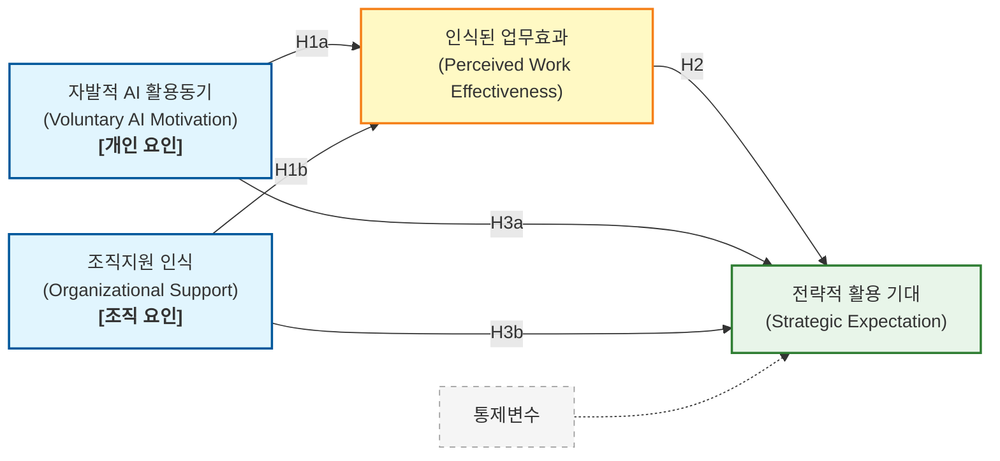

# 조직지원인식 vs AI활용동기 영향력 비교 분석 결과

데이터를 로드하고 통계 분석을 수행합니다...

## 1. 매개변수(effect)에 미치는 영향 (Path A)

### 비표준화 계수 (Unstandardized)
```text
AI활용동기(motivation) -> 매개변수(effect): 0.3168 (p=0.0000)
조직지원인식(support)  -> 매개변수(effect): 0.2624 (p=0.0000)
```

### 표준화 계수 (Standardized Beta) - 영향력 크기 비교용
```text
AI활용동기(motivation) -> 매개변수(effect): ß = 0.3495 (p=0.0000)
조직지원인식(support)  -> 매개변수(effect): ß = 0.2661 (p=0.0000)
```

## 2. 종속변수(expectation)에 미치는 영향 (총효과, Total Effect)

### 비표준화 계수 (Unstandardized)
```text
AI활용동기(motivation) -> 종속변수(expectation): 0.2501 (p=0.0000)
조직지원인식(support)  -> 종속변수(expectation): 0.3765 (p=0.0000)
```

### 표준화 계수 (Standardized Beta) - 영향력 크기 비교용
```text
AI활용동기(motivation) -> 종속변수(expectation): ß = 0.2669 (p=0.0000)
조직지원인식(support)  -> 종속변수(expectation): ß = 0.3694 (p=0.0000)
```

## 3. 종속변수(expectation)에 미치는 영향 (직접효과, Direct Effect - 매개변수 통제)

### 비표준화 계수 (Unstandardized)
```text
AI활용동기(motivation) -> 종속변수(expectation): 0.1338 (p=0.0060)
조직지원인식(support)  -> 종속변수(expectation): 0.2802 (p=0.0000)
```

### 표준화 계수 (Standardized Beta) - 영향력 크기 비교용
```text
AI활용동기(motivation) -> 종속변수(expectation): ß = 0.1428 (p=0.0060)
조직지원인식(support)  -> 종속변수(expectation): ß = 0.2748 (p=0.0000)
```

## 4. 종합 결과 비교 요약표 (표준화 계수 Beta 기준)

| 구분 | AI활용동기(motivation) | 조직지원인식(support) |
|---|---|---|
| 매개변수에 미치는 영향 | ß = 0.349 *** | ß = 0.266 *** |
| 종속변수에 미치는 총효과 | ß = 0.267 *** | ß = 0.369 *** |
| 종속변수에 미치는 직접효과 | ß = 0.143 ** | ß = 0.275 *** |

> († p<.10, * p<.05, ** p<.01, *** p<.001)

## 5. 상세 회귀 요약

<details><summary>매개변수 모형 - Path A</summary>

```text
===============================================================================
                  coef    std err          z      P>|z|      [0.025      0.975]
-------------------------------------------------------------------------------
Intercept       1.6702      0.227      7.372      0.000       1.226       2.114
motivation      0.3168      0.057      5.576      0.000       0.205       0.428
support         0.2624      0.045      5.860      0.000       0.175       0.350
gender          0.1945      0.067      2.897      0.004       0.063       0.326
rank_code      -0.0451      0.037     -1.204      0.228      -0.119       0.028
career_code     0.0088      0.043      0.207      0.836      -0.075       0.093
===============================================================================
```
</details>

<details><summary>종속변수 직접효과 모형 - Path C'</summary>

```text
===============================================================================
                  coef    std err          z      P>|z|      [0.025      0.975]
-------------------------------------------------------------------------------
Intercept       0.5547      0.218      2.549      0.011       0.128       0.981
motivation      0.1338      0.049      2.745      0.006       0.038       0.229
support         0.2802      0.052      5.340      0.000       0.177       0.383
effect          0.3672      0.055      6.643      0.000       0.259       0.476
gender          0.1243      0.068      1.837      0.066      -0.008       0.257
rank_code      -0.0310      0.038     -0.818      0.413      -0.105       0.043
career_code     0.0175      0.041      0.432      0.666      -0.062       0.097
===============================================================================
```
</details>

